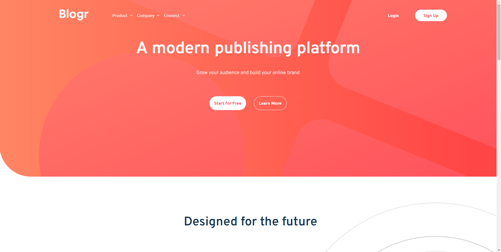
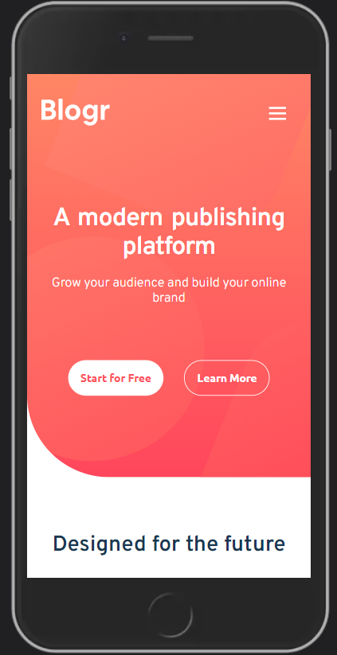

Hello!
This is my third project from Frontend Mentor.

The challenge of the project is: [Blogr landing page challenge on Frontend Mentor](https://www.frontendmentor.io/challenges/blogr-landing-page-EX2RLAApP)

## Table of contents

-  [Overview](#overview)
   -  [The challenge](#the-challenge)
   -  [Screenshot](#screenshot)
-  [My process](#my-process)
   -  [Built with](#built-with)
   -  [What I learned](#what-i-learned)
   -  [Continued development](#continued-development)
   -  [Useful resources](#useful-resources)
-  [Author](#author)

## Overview

This project was really difficult to carry out. Although, I think there is the idea, if the challenges were easy, they would not be challenges.
I always try to make my practices as comfortable for users, therefore, I have worked a lot on the "responsive design" part 😀
Finally, this is my first time that I implement Continuos Integration from Netlify. It much my work much faster.

### The challenge

Users should be able to:

-  View the optimal layout for the site depending on their device's screen size
-  See hover states for all interactive elements on the page

### Screenshot

Desktop

Mobile

## My process

### Built with

-  HTML with Handlebars
-  CSS
-  Flexbox
-  CSS Grid
-  [Webpack Init](https://github.com/Renato6GS/webpack-init) - My webpack init

### What I learned

I have learned quite a bit how to position the elementor. Come on, the easy solution is not always to place an absolute position to any element on the screen.
There are many other ways to do it, even a background-image can be quite useful to do this positioning job, somehing I did not know.
I am also proud of the way I handle "responsive design", since I think it is a very important part of developing a website.

### Continued development

-  I found that CSS Grid is much more complex and useful than it sounds. The next project will be implementing it much better.
-  Not everything written is made of stone, if things can be adapted to improve the user experience and facilitate development, of course I will do it for my next projects.

### Useful resources

-  [How To Create Advaced CSS Dropdown Menus](https://www.youtube.com/watch?v=S-VeYcOCFZw) - This helped me to create the dropdown with HTML and CSS in this practice.
-  [Animated Hamburger Menu](https://www.instagram.com/p/CRG-JZ7D2bt/) - This helped me how to create a animated hamburger menu for mobiles.
-  [Your Mobile Navigations Stink! Better UX AWAITS](https://www.youtube.com/watch?v=1D4FzPcEiN4) - This is an amazing video which helped me finally understand why the UX is so important. I'd recommend it to anyone still learning this concept.

## Author

-  Frontend Mentor - [@Renato6GS](https://www.frontendmentor.io/profile/Renato6GS)
